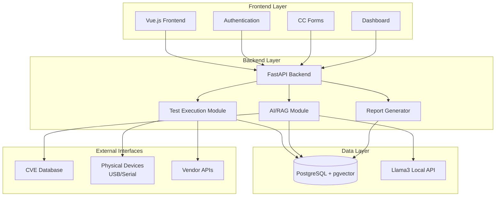
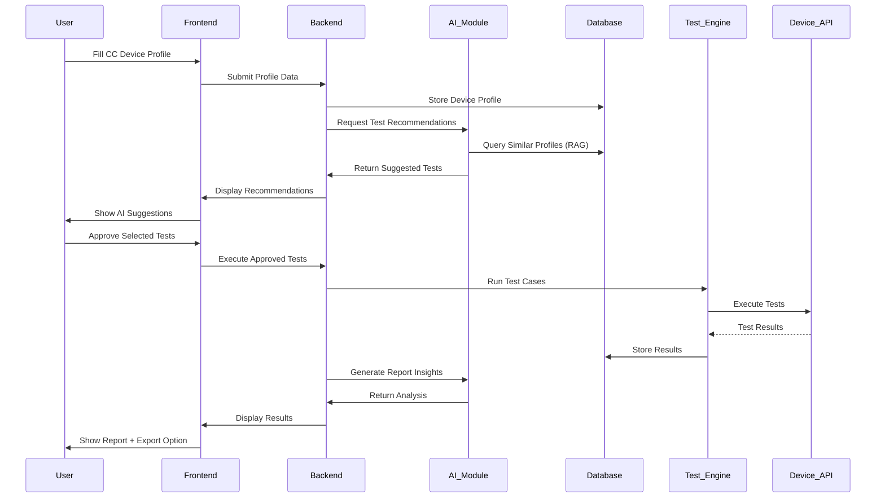
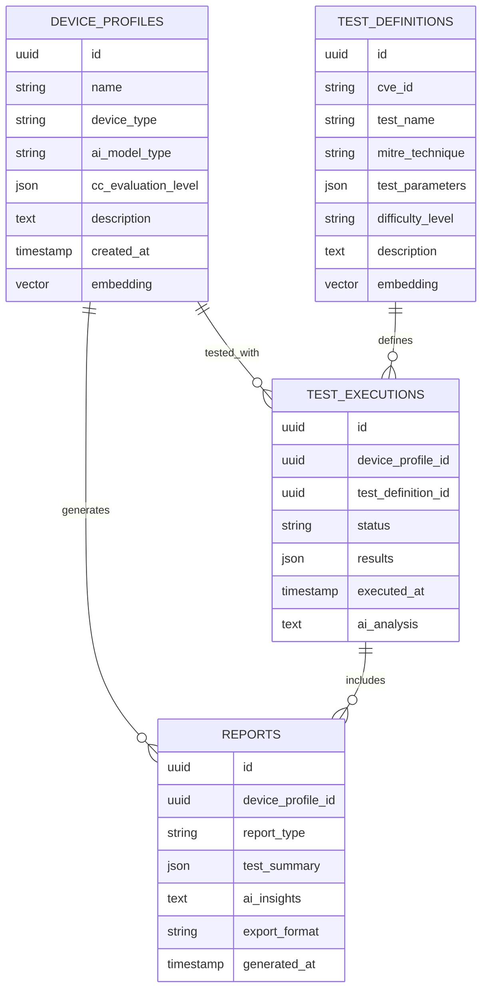

# **AI Testing Standard Solution**

## **Project Overview**
Develop an AI testing standard platform based on Common Criteria, targeting AI-integrated devices with CVE-based test cases and intelligent recommendations.

---

## **Quick Start Guide**

### **Prerequisites**
- Docker and Docker Compose
- Node.js (v18+)
- Python (v3.11+)

### **🚀 Option 1: Full Docker Setup**
```bash
# Start the complete stack (PostgreSQL + Backend)
docker-compose up -d

# Start the frontend separately
cd frontend
npm install
npm run dev
```

### **🛠️ Option 2: Development Setup**

#### **1. Database Setup**
```bash
# Start only PostgreSQL with pgvector
docker-compose up postgres -d
```

#### **2. Backend Setup**
```bash
cd backend

# Create virtual environment
python -m venv venv
source venv/bin/activate  # Linux/Mac
# or
venv\Scripts\activate     # Windows

# Install dependencies
pip install -r requirements.txt

# Run the backend
python -m uvicorn app.main:app --reload --host 0.0.0.0 --port 8000
```

#### **3. Frontend Setup**
```bash
cd frontend

# Install dependencies
npm install

# Start development server
npm run dev
```

### **🌐 Access URLs**
- **Frontend**: http://localhost:3000
- **Backend API**: http://localhost:8000
- **API Documentation**: http://localhost:8000/docs
- **PostgreSQL**: localhost:5432

---

## **🧪 Testing the Integration**

1. Open the frontend at http://localhost:3000
2. You should see:
   - ✅ Backend connection status
   - Message echo functionality
   - Test cases CRUD operations
   - Devices management
3. All data is persisted in PostgreSQL with pgvector extension

---

## **Technical Architecture**

### **Technology Stack**
- **Frontend**: Vue.js 3 + TypeScript + Vite
- **Backend**: FastAPI (Python) + SQLAlchemy + Async
- **Database**: PostgreSQL 16 + pgvector extension
- **AI Model**: Llama3 (local API) - *Coming Soon*
- **Deployment**: Docker + Docker Compose

### **Architecture Flow**
```
Frontend (Vue.js) ↔ Backend (FastAPI) ↔ Local AI API (Llama3)
                                    ↕
                            PostgreSQL + pgvector
```

### **Project Structure**
```
ngeaicc/
├── backend/                 # FastAPI application
│   ├── app/
│   │   ├── main.py         # Application entry point
│   │   ├── database.py     # Database configuration
│   │   ├── models/         # Pydantic schemas
│   │   └── routers/        # API endpoints
│   ├── requirements.txt    # Python dependencies
│   └── Dockerfile         # Backend container
├── frontend/               # Vue.js application
│   ├── src/
│   │   ├── App.vue        # Main component with API integration
│   │   └── services/      # API service layer
│   └── package.json       # Node.js dependencies
├── database/               # Database initialization
│   └── init/              # SQL scripts
└── docker-compose.yml     # Multi-service orchestration
```

---

## **🔧 Development Features**

### **Backend (FastAPI)**
- ✅ RESTful API with automatic OpenAPI documentation
- ✅ Async/await support with SQLAlchemy 2.0
- ✅ PostgreSQL integration with pgvector for AI embeddings
- ✅ CORS enabled for frontend communication
- ✅ Pydantic models for request/response validation
- ✅ Database migrations with Alembic (ready)

### **Frontend (Vue.js)**
- ✅ Modern Vue 3 Composition API with TypeScript
- ✅ Responsive design with scoped CSS
- ✅ Axios integration for API communication
- ✅ Real-time status monitoring
- ✅ CRUD operations for test cases and devices
- ✅ Error handling and loading states

### **Database (PostgreSQL + pgvector)**
- ✅ Latest PostgreSQL 16 with pgvector extension
- ✅ Vector similarity search capabilities for AI features
- ✅ Sample data initialization
- ✅ Persistent storage with Docker volumes

---

## **🎯 Core Features (Planned)**

### **1. Testing Approach**
- **Dual Mode**: API-based testing + Physical device testing (USB/serial)
- **CVE-Based**: Real-world vulnerability test cases
- **Custom Tests**: User-defined test creation capability
- **Framework**: MITRE ATT&CK/ATLAS integration

### **2. Common Criteria Implementation**
- **Scope**: All EAL levels (EAL1-7)
- **Forms**: Online CC-compliant device profiling
- **Output**: Professional SAR documentation

### **3. AI Integration (RAG)**
- **Test Recommendations**: AI suggests relevant tests based on device profile
- **Smart Assistance**: "Autocomplete for testing" throughout platform
- **Report Generation**: AI-enhanced analysis and insights

---

## **🚧 Next Steps**

1. **Authentication System** - JWT-based user authentication
2. **AI Integration** - Llama3 API integration for recommendations
3. **Test Execution Engine** - Run actual security tests
4. **Common Criteria Forms** - Interactive CC compliance forms
5. **Report Generation** - Professional SAR document creation
6. **Physical Device Interface** - USB/Serial device communication

---

## **🤝 Contributing**

This is the foundational setup for the AI Testing Standard Platform. The current implementation provides:

- **Working FastAPI ↔ Vue.js communication**
- **PostgreSQL with pgvector extension**
- **Sample CRUD operations**
- **Docker-based deployment**
- **Development-ready environment**

Start building your features on top of this solid foundation!

### **Phase 2: Single Test + Report**
- One working test case (API-based)
- Basic report generation (Word/PDF export)
- Proof of concept validation

### **Phase 3: AI Integration** (Future)
- Llama3 integration
- RAG implementation (chunking, searching, indexing module)
- Smart recommendations

---

## **Key Design Decisions**
- **USB/IP Docker** (Hardware access via IP)
- **Local AI API** (all AI interactions via own endpoints)
- **CVE-driven testing** (real vulnerability focus)
- **Human approval required** (no automatic test execution)
- **Exportable reports** (Word/Excel document format)

---

## **Architecture Diagrams**

### **High-Level Architecture**


### **Data Flow**


### **Database Schema**

