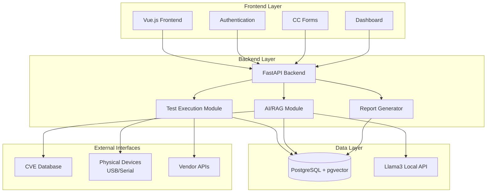
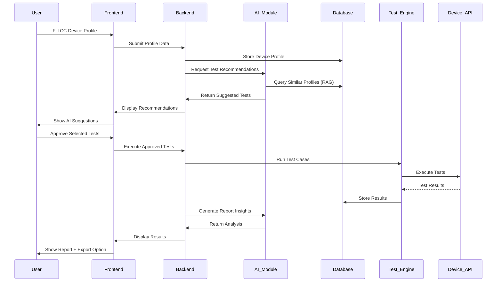
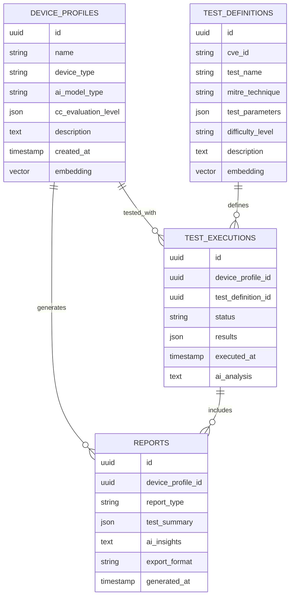

# **AI Testing Standard Solution - Complete Project Documentation**

## **Project Overview**
Develop an AI testing standard platform based on Common Criteria, targeting AI-integrated devices with CVE-based test cases and intelligent recommendations.

---

## **Technical Architecture**

### **Technology Stack**
- **Frontend**: Vue.js
- **Backend**: FastAPI (Python)
- **Database**: PostgreSQL + pgvector
- **AI Model**: Llama3 (local API)
- **Deployment**: No Docker initially (due to USB/serial port requirements)

### **Architecture Flow**
```
Frontend (Vue.js) ↔ Backend (FastAPI) ↔ Local AI API (Llama3)
                                    ↕
                            PostgreSQL + pgvector
```

---

## **Core Features**

### **1. Testing Approach**
- **Dual Mode**: API-based testing + Physical device testing (USB/serial)
- **CVE-Based**: Real-world vulnerability test cases
- **Custom Tests**: User-defined test creation capability
- **Framework**: MITRE ATT&CK/ATLAS integration

### **2. Common Criteria Implementation**
- **Scope**: All EAL levels (EAL1-7)
- **Forms**: Online CC-compliant device profiling
- **Output**: Professional SAR documentation

### **3. AI Integration (RAG)**
- **Test Recommendations**: AI suggests relevant tests based on device profile
- **Smart Assistance**: "Autocomplete for testing" throughout platform
- **Report Generation**: AI-enhanced analysis and insights
- **Human-in-the-Loop**: User approval required for AI recommendations

---

## **MVP Development Plan**

### **Phase 1: Foundation**
- Basic FastAPI ↔ Vue.js communication
- Simple authentication (login page)
- Database setup with basic schema

### **Phase 2: Single Test + Report**
- One working test case (API-based)
- Basic report generation (Word/PDF export)
- Proof of concept validation

### **Phase 3: AI Integration** (Future)
- Llama3 integration
- RAG implementation (chunking, searching, indexing module)
- Smart recommendations

---

## **Key Design Decisions**
- **No Docker initially** (hardware access complexity)
- **Local AI API** (all AI interactions via own endpoints)
- **CVE-driven testing** (real vulnerability focus)
- **Human approval required** (no automatic test execution)
- **Exportable reports** (Word document format)

---

## **Architecture Diagrams**

### **High-Level Architecture**


### **Data Flow**


### **Database Schema**

